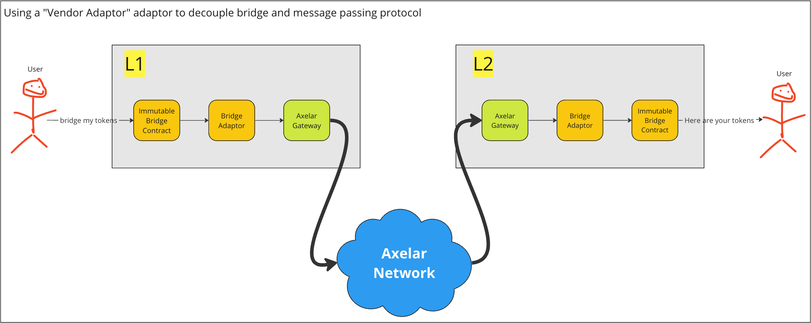

# ERC20 and Ether Bridge Threat Model

# Contents

- [Introduction](#introduction)
- [Architecture](#architecture)
- [Attack Surfaces](#attack-surfaces)
- [Perceived Attackers](#preceived-attackers)
- [Attack Mitigation](#attack-mitigation)
- [Conclusion](#conclusion)

# Introduction

This document is a threat model for a ETH, IMX and ERC20 token bridge that Immutable has built to integrate with the Axelar General Message Passing (GMP) bridge. The token bridge was forked from Polygon Edge's RootERC20Predicate and ChildERC20Predicate contract available [here](https://github.com/0xPolygon/core-contracts) with most of the Edge-specific functionality removed leaving a standard ERC20 token bridge.

The features of the changes introduced are:
- Support for native ETH and ERC20 bridging from Ethereum (L1) to Immutable zkEVM (L2).
  - Native ETH is represented on Immutable zkEVM as an ERC20 token. 
  - wETH will be auto-unwrapped on Ethereum before bridging it across as native ETH i.e. ETH and wETH will be consolidated to the same ERC20 token on Immutable zkEVM. All users will receive native ETH when withdrawing to Ethereum.
- Support for native IMX and ERC20 bridging from Immutable zkEVM (L2) to Ethereum (L1).
  - IMX is represented on Immutable zkEVM as the native gas token.
  - IMX is represented on Ethereum as a ERC20 token, see [here](https://etherscan.io/token/0xf57e7e7c23978c3caec3c3548e3d615c346e79ff).
  - As a result, a wIMX ERC20 token contract will be deployed for compatibility and usage with our Seaport and DEX contract.
  - wIMX will be auto-unwrapped on Immutable zkEVM before bridging it across as IMX i.e. IMX and wIMX will be consolidated to the same ERC20 token on Ethereum. All users will receive the canonical IMX ERC20 token when withdrawing to Ethereum.
- Ability for the contracts to be upgraded.
- Ability for the contracts to be paused.
- Use Axelar as the General Message Passing (GMP) bridge to send messages to and fro Ethereum and Immutable zkEVM
- Decouple our token bridge contracts from Axelar to future proof a change of the GMP to a zk-proof-based bridge
- The sender and receiver of bridged tokens can be different addresses.
- Flow rate integration for withdrawals from Immutable zkEVM to Ethereum

Additional Axelar requirements:
- Axelar will host the relaying service on behalf of Immutable.
- We will leverage Axelar's full validator set for the safety and liveness of our bridge.
- Axelar will provide a one-step bridging experience i.e. there's no need to sign a separate transaction to claim your funds on the destination chain

# Architecture 

