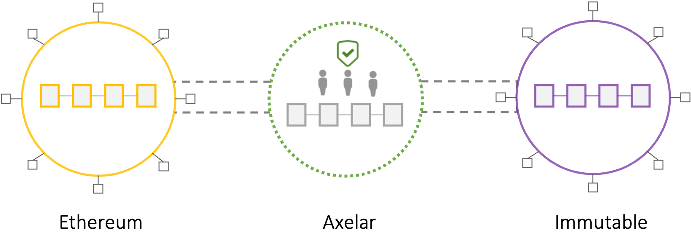
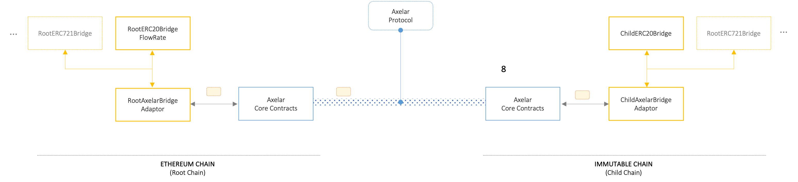

# High-Level Architecture and Threat Model

<!-- TOC -->
* [Introduction](#introduction)
  * [Purpose](#purpose)
  * [Scope](#scope)
* [Background](#background)
    * [Cross-chain Messaging Stack](#cross-chain-messaging-stack)
    * [Axelar GMP Bridge](#axelar-gmp-bridge)
    * [Immutable zkEVM](#immutable-zkevm)
* [Immutable Token Bridge]()
  * [Core Features](#core-features)
  * [Security Features](#security-features) 
* [Architecture](#architecture)
  * [System Overview](#adaptor-pattern)
  * [Core Components](#adaptor-pattern)
* [Deployment Architecture]()
* [Threat Model]()
  * [Threat Identification](#threat-identification)
  * [Threat Analysis](#threat-identification)
  * [Mitigation Strategies](#mitigation-strategies)
* [Glossary](#glossary)
<!-- TOC -->

# Introduction
## Purpose
This document outlines a high-level architecture and threat model for the token bridge between Ethereum ("Root" chain) and the Immutable zkEVM ("Child" chain) chains. The bridge facilitates the transfer of ETH, IMX, and standard ERC20 tokens between these chains, using an underlying General Message Passing (GMP) bridge, Axelar, for message transmission. This bridge is a critical piece of infrastructure for the Immutable chain, that will potentially custody significant amount of user assets.

The purpose of this document is to two-fold:
1. Provide a high-level view of the Immutable bridge's architecture, in terms of its core functionalities and use-cases, major components and their interactions, dependencies and architectural characteristics.
2. Provide a threat-model that systematically identifies, analyzes, and addresses potential security risks related to the token bridge. This includes: 
   1. Risk Identification: To enumerate and describe potential threats that could compromise the integrity, security, and functionality of the token bridge.
   2. Impact Analysis: To assess the potential impact of these threats on stakeholders.
   3. Mitigation Strategy Development: To outline strategies to mitigate these risks.

## Scope
This document primarily focuses on the on-chain part of the Immutable token bridge infrastructure, covering its design, implementation, and operational aspects. Although various off-chain components and services will support this infrastructure, they are not included in the scope of this document. Furthermore, key dependencies like the GMP and underlying chains are only discussed at a high level, to the extent they influence the bridge's security model.

# Immutable Token Bridge
The Immutable Bridge facilitates the transfer of assets between two chains, namely Ethereum (the Root chain) and the Immutable chain (the Child chain). At present, the bridge only supports the transfer of standard ERC20 tokens originating from Ethereum, as well as native assets (ETH and IMX). Other types of assets (such as ERC721) and assets originating from the Child chain are not currently supported.

## Core Features
The bridge provides two key functions, **deposits** and **withdrawals**. 

### Deposit Assets (Root Chain → Child Chain)
When a user wishes to transfer assets from Ethereum to Immutable, they initiate a deposit. This deposit moves an asset from the Root chain to the Child chain. It does so by first transferring the user's asset to the bridge (Root chain), then minting and transferring corresponding representation tokens of that asset to the user, on the Child chain. The following types of asset deposits flows are supported:
1. Native ETH on Ethereum  → Wrapped ETH on Immutable zkEVM (ERC20 token)
2. Wrapped ETH on Ethereum → Wrapped ETH on Immutable zkEVM (ERC20 token)
3. ERC20 IMX on Ethereum   → Native IMX on Immutable zkEVM. IMX is represented on Immutable zkEVM as the native gas token, see [here](https://etherscan.io/token/0xf57e7e7c23978c3caec3c3548e3d615c346e79ff)
4. Standard ERC20 tokens   → Wrapped equivalents on Immutable zkEVM (ERC20 token)

### Withdraw Assets (Child Chain → Root Chain)
When a user wants to transfer bridged assets from Immutable back to Ethereum, they start a withdrawal. This process moves an asset from the Child chain to the Root chain. It includes burning the user's bridged tokens on the child chain and unlocking the corresponding asset on the Root chain. Only assets that were bridged using the deposit flow described above can be withdrawn. Therefore, the available withdrawal flows are as follows:
1. Native IMX on Immutable zkEVM →  for ERC20 IMX on Ethereum.
2. Wrapped ETH on Immutable zkEVM →  Native ETH on Ethereum
3. Wrapped IMX on Immutable zkEVM →  for ERC20 IMX on Ethereum
4. Wrapped ERC20 on Immutable zkEVM →  Original ERC20 on Ethereum

**Not supported:**
The following capabilities are not currently supported by the Immutable bridge:
- Bridging of tokens that were originally deployed on the Child chain (i.e. ones that do not originate from the Root chain).
- Bridging of non-standard ERC20 tokens
- Bridging of ERC721 or other tokens standards

## Security Features
The bridge employs a number of security features to mitigate the likelihood and impact of potential exploits. These are discussed further in subsections below.

### IMX Deposit Limit
The total amount of IMX that can be deposited (i.e. sent from the Root chain to the Child chain), is capped at a configurable threshold. In addition to mitigating the potential impact of an exploit, this limit serves to reduce the likelihood of scenarios where the bridge might not have sufficient native IMX to process the deposits on the child chain.

### Withdrawal Delays
To mitigate the impact of potential exploits, withdrawal transactions (token transfers from the Child chain to the Root chain) may be automatically delayed under certain conditions. By default, this delay is one day. The delay is implemented as a withdrawal queue, which is an array of withdrawal transactions for each user. Once the required delay has passed, a user can finalize a queued withdrawal. The conditions that trigger a withdrawal delay are as follows:
   - Specific flow rates can be set for individual tokens. These rates regulate the amount that can be withdrawn over a period of time. If a token's withdrawal rate exceeds its specific threshold, all subsequent withdrawals from the bridge are queued.
   - Any withdrawal that exceeds a token-specific amount is queued. This only affects the individual withdrawal in question and does not impact other withdrawals by the same user or others.
   - If no thresholds are defined for a given token, all withdrawals relating to that token are queued.

### Emergency Pause
In the event of an emergency, the bridge can be paused to mitigate the potential impact of an incident. This suspends all user-accessible capabilities, including token mapping, deposits, and withdrawals, until the bridge is resumed. However, this doesn't restrict privileged functions accessible by accounts with certain roles. It allows administrators to perform necessary operations that can address the incident (e.g., bridge parameter changes, upgrades).

### Role-Based-Access-Control
The bridge employs fine-grained Role-Based-Access-Controls (RBAC), for privileged operations that control various parameters of the bridge. These include:
- `DEFAULT_ADMIN_ROLE`: Can manage granting and revoking of roles to accounts.
- `VARIABLE_MANAGER_ROLE`: Can update the cumulative IMX deposit limit.
- `RATE_MANAGER_ROLE`: Can enable or disable the withdrawal queue, and configure parameter for each token related to the withdrawal queue.
- `BRIDGE_MANAGER_ROLE`: Can update the bridge used by the adaptor.
- `ADAPTOR_MANAGER_ROLE`: Can update the bridge adaptor.
- `TARGET_MANAGER_ROLE`: Can update targeted bridge used by the adaptor (e.g. target is child chain on root adaptors).
- `GAS_SERVICE_MANAGER_ROLE`: Role identifier for those who can update the gas service used by the adaptor.
- `PAUSER_ROLE`: Role identifier for those who can pause functionanlity.
- `UNPAUSER_ROLE`: Role identifier for those who can unpause functionality

## Background

### Cross-chain Messaging
Cross-chain protocols can be arranged into a conceptual model containing layers of abstraction based on scope and functionality. Each layer relies on the layers beneath it for functionality and security. As a result, the architectural risks at each layer encompass those below.

At the lowest level is the messaging protocol, also known as the General Messaging Protocol (GMP). This protocol facilitates the transmission of arbitrary messages across chains and ensures the validity and finality of any information sent from a source network to a destination network.

Token bridges rely on underlying messaging bridges to enable the transfer of assets from a source to a destination network. Token bridges mimic this transfer of an asset by locking the original asset in the source network and issuing a synthetic representation on the destination. The original asset remains encumbered for as long as the synthetic token exists on the destination. When a user wants to redeem the original asset on the source network, the synthetic assets are burnt on the destination network and the original assets unlocked on the source network. Locked assets in a token bridge create a honey-pot for attackers, which has thus made them the primary targets of bridge-related hacks to date. This method is widely used as it is the only way to transfer assets to a network where they were not initially issued.  

The Immutable bridge, is a token bridge. It relies on an underlying messaging protocol provided by Axelar. 

Cross-chain Messaging Stack

### Axelar Bridge: General Purpose Messaging Protocol
Axelar is a general-purpose cross-chain messaging protocol that uses cryptoeconomic guarantees for security. The protocol employs a delegated [proof-of-stake](https://crosschainriskframework.github.io/framework/20categories/20architecture/architecture/#proof-of-stake) mechanism and a permissionless set of validators coordinated through a [Tendermint](https://tendermint.com/)-based blockchain network. Validators are incentivized with block rewards, and penalised if they deviate from the protocol or experience extended downtimes. This incentivizes validators to operate performant and secure validator nodes and behave honestly. The protocol's safety and liveness guarantees stem directly from the financial stake of the validator set and the in-protocol mechanism that governs their behavior.

Axelar's validator network comprise 75 active validators, and employs a quadratic voting mechanism to achieve consensus. This approach helps to distribute voting power more evenly across validators and mitigate risks associated with the concentration of stake distribution and centralization. The protocol sets a 60% safety threshold by quadratic share of voting power, which, with the current distribution of stake, requires at least 30 out of 70 validators to sign a message for it to be considered valid.

If a quorum of validators is compromised or colludes, fraudulent messages could be submitted and executed. Similarly, if a bug or vulnerability in the protocol enabled spoofing a quorum, then safety could be compromised. Furthermore, under the current distribution of stake, the protocol’s liveness would be impacted if roughly 19 validators failed simultaneously. This same threshold of validators could censor messages if they choose to do so.

Axelar General-purpose Messaging Bridge

### Immutable Chain
The Immutable chain is an EVM-based single sequencer chain, derived from a fork of the Geth client and operating on the Clique consensus protocol. As a permissioned chain, it has a fixed set of validators. The chain utilizes a native token, IMX, for transaction gas payments. An ERC20 version of IMX also exists on Ethereum. Upon the launch of the Immutable chain, native IMX will be pre-mined to support the floating supply of IMX on Ethereum. Users bridging IMX from Ethereum to Immutable will receive native IMX on the Immutable chain. The Immutable bridge will maintain a supply of IMX to service this bridging process.

## System Overview

### Stakeholders
The following stakeholders are involved in the bridge's design, implementation, and operation:
1. Users: Users are the primary stakeholders of the bridge. They are the ones who deposit and withdraw assets from the bridge. They are also the ones who are impacted by any potential exploits.
2. Token holders: Token holders are the stakeholders who hold the tokens that are bridged. They are impacted by any potential exploits that affect the bridge, as this could significantly impact the value of their tokens.
2. Bridge Operators: Bridge operators are the entities that operate the bridge. They are responsible for the bridge's security, maintenance, and upgrades. They are also responsible for the bridge's operational aspects, such as key management, deployment, and configuration.In the context of Immutable Bridge, this role is undertaken exclusively by Immutable.

### Core Components
The Immutable Bridge consists of a set of solidity smart contracts deployed on both the Root and Child chains. These contracts handle enable capabilities such as deposits, withdrawals, and token mapping between the Root and Child chains, as discussed in the [core features](#core-features*) section.

The design of the contracts follows an adaptor pattern, which abstracts away GMP specific functionality from the core bridge functionality. This allows the bridge to be easily ported to other GMPs if required. 

Hence, the contracts consist of adaptors, which handle GMP specific message sending and receiving functionality, and bridge contracts, which handle the core bridge functionality.

Both adaptors and bridge contracts are upgradeable, and follow the Transparent Proxy pattern. This allows the bridge to be upgraded without requiring users to interact with a new contract address.

The smart contracts include:
1. [Root Chain](https://github.com/immutable/zkevm-bridge-contracts/tree/main/src/): Contracts deployed on the Root Chain include:
    - [`RootERC20Bridge`](../src/root/RootERC20Bridge.sol): The bridge contract that handles mapping, deposits and withdrawals of ERC20 tokens, and native tokens between the Root and Child chains.
    - [`RootERC20BridgeFlowRate`](../src/root/RootERC20BridgeFlowRate.sol): Extends `RootERC20Bridge` to include flow rate control functionality. This is the primary bridge contract that users will interact with.
    - [`FlowRateDetection`](../src/root/flowrate/FlowRateDetection.sol): Implements flow rate control detection functionality.
    - [`FlowRateWithdrawalQueue`](../src/root/flowrate/FlowRateWithdrawalQueue.sol): Implements withdrawal queue functionality.
    - [`RootAxelarBridgeAdaptor`](../src/root/RootAxelarBridgeAdaptor.sol): Enables the bridge to send and receive messages to and from the Axelar GMP bridge.
2. [Child Chain](https://github.com/immutable/zkevm-bridge-contracts/tree/main/src/): Contracts deployed on the Child Chain include:
    - [`ChildERC20Bridge`](../src/child/ChildERC20Bridge.sol): The bridge contract that handles mapping, deposits and withdrawals of ERC20 tokens, and native tokens between the Root and Child chains.
    - [`ChildAxelarBridgeAdaptor`](../src/child/ChildAxelarBridgeAdaptor.sol): Enables the bridge to send and receive messages to and from the Axelar GMP bridge.

# Glossary
- General Message Passing (GMP) bridge: A bridge that enables the transfer of arbitrary messages between two chains. The GMP bridge used by the Immutable zkEVM token bridge is [Axelar](https://axelar.network/).
- Token bridge: A bridge that enables the transfer of tokens between two chains, using an underlying GMP. The Immutable zkEVM bridge is a token bridge.
- Layer 1 (L1): Refers to Ethereum, which is also referred to as the Root chain in this document.
- Layer 2 (L2): Refers to Immutable zkEVM, which is also referred to as the Child chain in this document.
- Root chain: Refers to the Layer 1 chain, which is Ethereum.
- Child chain: Refers to the Layer 2, which is the Immutable zkEVM chain.
- Deposit: The transfer of tokens from the Root chain to the Child chain.
- Withdrawal: The transfer of tokens from the Child chain to the Root chain.
- Root token: An original token that is deployed on the Root chain.
- Child token: A wrapped token that is deployed on the Child chain, which is used to represent the Root token on the Child chain.
